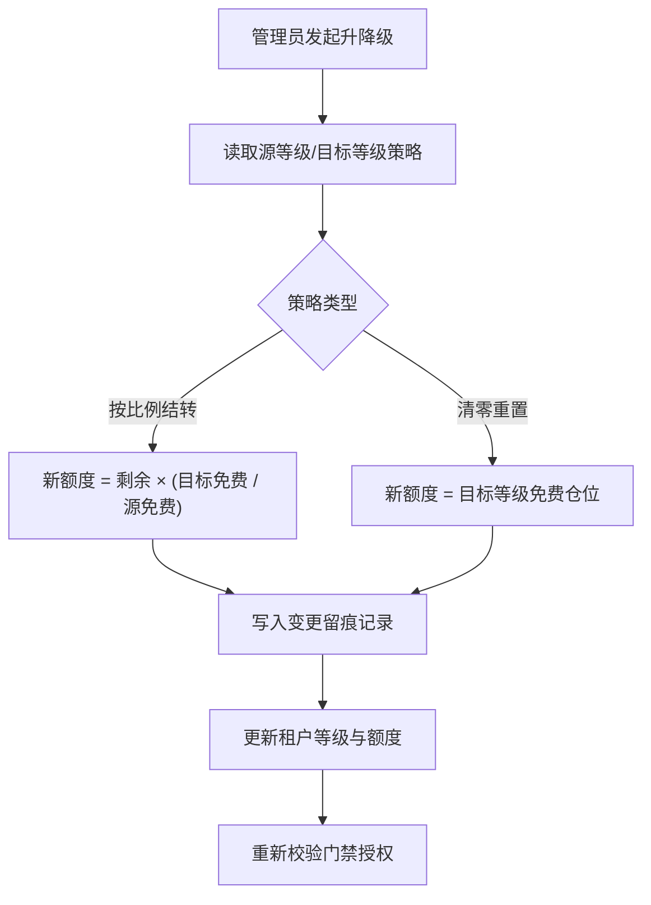
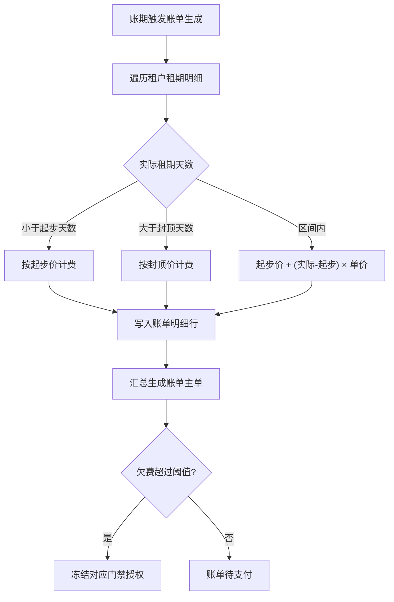

# 迷你仓出租管理系统 PRD

## 1. 产品概述

迷你仓（Self-Storage）出租管理Web应用，面向运营方提供租户等级额度管理、计费规则配置、账单自动生成及门禁授权一体化解决方案。通过等级差异化免费仓位、升降级时的额度按比例结转/清零机制，以及起步价+封顶价的计费边界处理，实现精细化运营。

目标市场：中小型迷你仓运营商，需要灵活的会员体系、自动化计费与完整的审计留痕能力。

---

## 2. 核心功能

### 2.1 用户角色

| 角色 | 注册方式 | 核心权限 |
|------|----------|----------|
| 运营管理员 | 后台账号登录 | 全权限：等级配置、租户管理、额度调整、账单生成、门禁授权、变更审计 |
| 租户 | 管理员录入/自助申请 | 查看个人等级、额度余额、账单记录、门禁状态；申请升降级 |

### 2.2 功能模块

1. **等级额度模块**：租户等级配置（免费仓位数、额度比例）、额度发放、等级额度差异展示、升降级额度结转（按比例/清零策略）
2. **变更留痕模块**：等级变更历史、额度调整记录、操作人/时间/原因完整审计链路
3. **计费规则模块**：起步价设置、封顶价设置、短租起步拦截、长租封顶拦截、按天/按月计费策略
4. **账单生成模块**：周期账单自动生成、账单明细、状态管理（待支付/已支付/逾期）、账单导出

### 2.3 页面详情

| 页面名称 | 模块名称 | 功能描述 |
|----------|----------|----------|
| 仪表盘 | 数据概览卡 | 在租仓库数、本月收入、各等级租户分布、额度使用率Top10 |
| 仪表盘 | 趋势图表 | 近30天账单收入趋势、升降级事件时间线 |
| 租户管理 | 租户列表 | 搜索、筛选（等级/状态）、租户卡片、快速升降级入口 |
| 租户管理 | 租户详情 | 基本信息、当前等级与额度、仓储清单、门禁授权、账单历史、变更轨迹 |
| 等级配置 | 等级列表 | 等级卡片（名称/免费仓位/升降级策略/颜色标识）、拖拽排序 |
| 等级配置 | 等级表单 | 新增/编辑：等级名称、免费仓位数、升级结转比例、降级结转比例、是否清零 |
| 额度管理 | 额度台账 | 按租户筛选的额度流水：发放/扣减/结转/清零，显示操作人与备注 |
| 额度管理 | 手工调整 | 管理员手动发放或扣减额度，强制填写原因 |
| 计费规则 | 规则配置 | 起步价（天/金额）、封顶价（天/金额）、超出单价（元/天/仓）、阶梯单价 |
| 计费规则 | 试算工具 | 输入租期与仓位，实时计算含边界处理的应收金额 |
| 账单管理 | 账单列表 | 账期、租户、金额、状态筛选；批量标记已支付；导出Excel |
| 账单管理 | 账单详情 | 计费明细行：仓位、租期、天数、起步/封顶标识、单价、小计 |
| 门禁管理 | 门禁列表 | 仓库单元与授权租户、授权起止日期、门禁状态（正常/冻结/过期） |
| 门禁管理 | 授权操作 | 新增/撤销授权，联动等级额度校验与账单欠费检查 |
| 变更审计 | 完整日志 | 全系统操作审计：操作人IP、时间戳、变更前后快照JSON、操作类型标签 |

---

## 3. 核心流程

### 3.1 租户升降级与额度结转

管理员在租户详情页选择目标等级 → 系统读取源等级与目标等级的结转策略 → 若为"按比例结转"：新可用额度 = 剩余额度 × (目标等级免费仓位 / 源等级免费仓位)；若为"清零"：新可用额度 = 目标等级免费仓位 → 写入等级变更记录（含操作人、原因、前后等级、结转计算式） → 更新租户当前等级与额度 → 触发门禁授权重新校验。

### 3.2 账单生成与计费边界处理

每月1号（或指定账期日）触发批量账单 → 遍历每个在租租户 → 逐条租期明细计算：实际天数 < 起步天数 → 按起步价计费；实际天数 > 封顶天数 → 按封顶价计费；中间区间 → 超出起步天数 × 单价 + 起步价 → 汇总生成账单 → 欠费超过阈值自动冻结对应门禁。

---

## 4. 用户界面设计

### 4.1 设计风格

- **主色与辅色**：主色采用深靛蓝 `#1E3A5F`（专业仓储、信任感）；辅色采用暖琥珀 `#E8A838`（高亮、提醒）；成功绿 `#2E8B57`、警告橙 `#D97706`、危险红 `#DC2626`
- **按钮风格**：圆角 6px，主按钮采用靛蓝渐变+微内阴影，悬停时上浮 1px + 柔和光晕；次要按钮描边透明底
- **字体**：标题使用思源宋体 CN Semibold（商务厚重），正文使用思源黑体 CN Regular（高可读性），数字栏位使用 JetBrains Mono（记账风格对齐）
- **布局风格**：左侧固定导航（240px，靛蓝深色底 + 金色图标点缀）+ 右侧内容区卡片栅格；重要数据卡采用悬浮阴影 + 金边微倒角；台账表格采用斑马纹 + 行悬停高亮
- **图标风格**：线性图标（Lucide）统一 1.5px 线宽，关键操作按钮辅以 emoji 语义化标识（如 🏠 仓库、💰 账单、🔑 门禁）

### 4.2 页面设计概览

| 页面名称 | 模块名称 | UI 元素 |
|----------|----------|---------|
| 仪表盘 | 数据概览卡 | 4 张主指标卡（渐变色块 + 大号数字 + 同比%），卡片顶部有 3px 彩色装饰条；进入时依次错位淡入 |
| 仪表盘 | 趋势图表 | 收入趋势（面积图，靛蓝渐变填充）+ 升降级事件（散点，琥珀色锚点）；鼠标悬停显示气泡详情 |
| 租户管理 | 租户卡片 | 头像+等级徽章（颜色对应等级）+ 额度进度条（含已用/总额数字）+ 快捷操作悬浮按钮组 |
| 租户管理 | 变更轨迹 | 竖向时间轴，每个节点有圆点（颜色对应事件类型）+ 事件摘要卡片，点击展开变更前后 JSON diff |
| 等级配置 | 等级卡片 | 竖直排列的等级卡片，左侧彩色竖条区分等级，中央大字展示免费仓位数，底部策略标签（比例/清零） |
| 计费规则 | 试算工具 | 左侧滑杆输入（租期天数、仓位数），右侧大号数字实时跳变；当触发起步/封顶时高亮对应标签并闪烁一次 |
| 账单管理 | 账单详情 | 仿纸质发票布局：顶部公司抬头与账单编号，中间表格明细行，底部合计与公章样式的状态章 |
| 门禁管理 | 状态徽章 | 门禁状态采用"印章"风格：正常（绿色圆章 "正常"）、冻结（红色斜杠 "冻结"）、过期（灰色虚线 "过期"） |

### 4.3 响应式

- 桌面优先设计（≥1280px）：左侧导航固定展开，内容区最多 4 列卡片栅格
- 平板（768px-1279px）：左侧导航折叠为图标栏（56px），卡片降为 2 列
- 移动（<768px）：导航收至底部 Tab 栏，卡片单列堆叠，表格切换为卡片式列表视图
- 触控优化：按钮最小点击区 44×44px，台账表格支持左右滑动查看隐藏列

---

## 5. 非功能需求

- **性能**：账单生成 1000 租户 ≤ 5s；页面首屏 ≤ 1.5s
- **安全**：所有变更操作强制记录操作人 IP 与时间；额度/账单修改需二次确认弹窗
- **可导出**：账单、台账、审计日志支持 Excel（xlsx）与 PDF 导出
