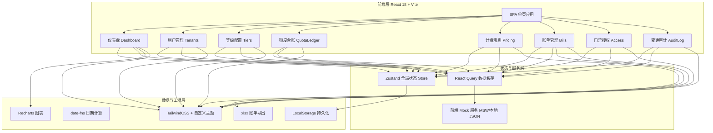
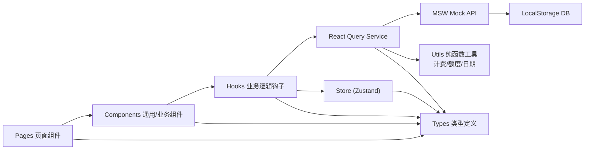
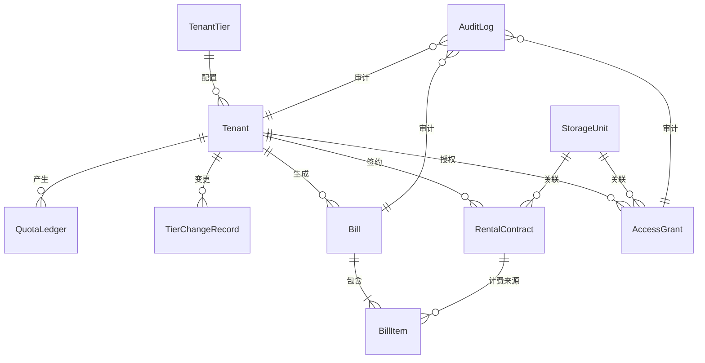

# 迷你仓出租管理系统 技术架构文档

## 1. 架构设计



---

## 2. 技术描述

- **前端框架**：React@18.2 + TypeScript@5 + Vite@5
- **初始化工具**：`npm create vite@latest mini-storage -- --template react-ts`
- **路由**：react-router-dom@6（HashRouter，避免部署需配置 history fallback）
- **UI 样式**：tailwindcss@3 + postcss + autoprefixer（自定义颜色/字体/圆角 design token）
- **状态管理**：zustand@4（轻量 Store：租户、等级、账单、门禁、审计）
- **数据请求/缓存**：@tanstack/react-query@5（统一管理 loading/error/缓存失效）
- **图表**：recharts@2（面积图、柱状图、饼图）
- **表单**：react-hook-form@7 + zod@3（类型安全的表单校验）
- **日期处理**：date-fns@3（租期计算、账期边界、格式化）
- **导出**：xlsx@0.18（账单 Excel 导出）
- **图标**：lucide-react@0.344（线性图标集）
- **后端**：无独立后端，使用前端 Mock Service Worker（msw@2）+ localStorage 持久化模拟服务端，后续可无缝替换为真实 REST API
- **数据库**：localStorage 持久化 + 内存数据结构，内置完整初始化 seed 数据

---

## 3. 路由定义

| 路由 | 页面组件 | 用途 |
|------|----------|------|
| `/` | `DashboardPage` | 仪表盘：数据概览 + 趋势图 |
| `/tenants` | `TenantListPage` | 租户列表与检索 |
| `/tenants/:id` | `TenantDetailPage` | 租户详情：等级、额度、仓储、门禁、变更轨迹 |
| `/tiers` | `TierConfigPage` | 等级配置：列表 + 新增/编辑表单 |
| `/quota` | `QuotaLedgerPage` | 额度台账：流水列表 + 手工调整 |
| `/pricing` | `PricingRulePage` | 计费规则：配置 + 试算工具 |
| `/bills` | `BillListPage` | 账单列表 + 批量操作 |
| `/bills/:id` | `BillDetailPage` | 账单详情（仿发票样式）+ 导出 |
| `/access` | `AccessControlPage` | 门禁授权：仓库列表 + 授权管理 |
| `/audit` | `AuditLogPage` | 全量变更审计日志 |

---

## 4. Mock API 与类型定义

### 4.1 核心领域类型

```typescript
// 租户等级
interface TenantTier {
  id: string;
  name: string;
  level: number;          // 数字越大等级越高
  freeQuota: number;      // 免费仓位数
  upgradeCarryRatio: number;  // 升级结转比例 0~1
  downgradeCarryRatio: number;// 降级结转比例 0~1
  resetOnDowngrade: boolean;  // 降级是否清零
  color: string;              // UI 标识色
}

// 租户
interface Tenant {
  id: string;
  name: string;
  phone: string;
  idCardNo: string;
  tierId: string;
  currentQuota: number;       // 当前可用额度（仓位数）
  totalUsedQuota: number;     // 累计已用
  status: 'active' | 'frozen' | 'terminated';
  createdAt: string;
  remark?: string;
}

// 额度流水
interface QuotaLedger {
  id: string;
  tenantId: string;
  type: 'grant' | 'consume' | 'refund' | 'carry' | 'reset' | 'manual';
  delta: number;          // 正数增加，负数减少
  balanceAfter: number;
  operatorId: string;
  operatorName: string;
  reason: string;
  relatedTierChangeId?: string;
  createdAt: string;
}

// 等级变更记录
interface TierChangeRecord {
  id: string;
  tenantId: string;
  fromTierId: string;
  toTierId: string;
  carryStrategy: 'ratio' | 'reset';
  carryRatio?: number;
  quotaBefore: number;
  quotaAfter: number;
  calculation: string;   // 计算过程字符串
  operatorId: string;
  operatorName: string;
  reason: string;
  createdAt: string;
}

// 计费规则
interface PricingRule {
  id: string;
  minDays: number;           // 起步天数
  minPrice: number;          // 起步价
  maxDays: number;           // 封顶天数
  maxPrice: number;          // 封顶价
  unitPricePerDay: number;   // 超出起步后单价（元/仓/天）
  overdueFreezeThreshold: number; // 欠费冻结阈值（元）
  updatedAt: string;
  updatedBy: string;
}

// 仓库单元
interface StorageUnit {
  id: string;
  code: string;          // 仓库编号 A-01, B-12
  zone: string;          // 区域 A/B/C
  size: 'S' | 'M' | 'L' | 'XL';
  status: 'idle' | 'rented' | 'maintenance';
}

// 租期
interface RentalContract {
  id: string;
  tenantId: string;
  unitId: string;
  startDate: string;
  endDate: string | null; // null 表示未到期
  status: 'active' | 'ended';
  actualDays?: number;
}

// 账单
interface Bill {
  id: string;
  billNo: string;              // 账单编号
  tenantId: string;
  periodStart: string;
  periodEnd: string;
  totalAmount: number;
  paidAmount: number;
  status: 'pending' | 'paid' | 'overdue' | 'void';
  items: BillItem[];
  issuedAt: string;
  paidAt?: string;
}

interface BillItem {
  id: string;
  billId: string;
  contractId: string;
  unitCode: string;
  days: number;
  pricingType: 'min' | 'normal' | 'max'; // 起步/正常/封顶
  unitPrice: number;
  subtotal: number;
  remark: string;
}

// 门禁授权
interface AccessGrant {
  id: string;
  tenantId: string;
  unitId: string;
  startDate: string;
  endDate: string;
  status: 'active' | 'frozen' | 'expired';
  frozenReason?: string;
  createdAt: string;
}

// 审计日志
interface AuditLog {
  id: string;
  operatorId: string;
  operatorName: string;
  operatorIp: string;
  action: string;                 // e.g. 'tier.change', 'bill.issue'
  targetType: string;             // e.g. 'Tenant', 'Bill'
  targetId: string;
  beforeSnapshot: Record<string, any> | null;
  afterSnapshot: Record<string, any> | null;
  createdAt: string;
}
```

### 4.2 核心 API 端点（MSW Mock）

| Method | Path | 用途 |
|--------|------|------|
| GET | `/api/tiers` | 获取等级列表 |
| POST | `/api/tiers` | 新增等级 |
| PUT | `/api/tiers/:id` | 编辑等级 |
| GET | `/api/tenants` | 租户列表（分页+筛选） |
| GET | `/api/tenants/:id` | 租户详情 |
| PATCH | `/api/tenants/:id/tier` | 升降级（触发额度结转） |
| GET | `/api/quota-ledger?tenantId=` | 额度流水 |
| POST | `/api/quota-ledger/manual` | 手工调整额度 |
| GET | `/api/pricing` | 获取计费规则 |
| PUT | `/api/pricing` | 更新计费规则 |
| POST | `/api/pricing/calculate` | 计费试算 |
| GET | `/api/bills` | 账单列表 |
| GET | `/api/bills/:id` | 账单详情 |
| POST | `/api/bills/generate` | 触发批量账单生成 |
| PATCH | `/api/bills/:id/paid` | 标记已支付 |
| GET | `/api/access-grants` | 门禁授权列表 |
| POST | `/api/access-grants` | 新增门禁授权 |
| PATCH | `/api/access-grants/:id/freeze` | 冻结门禁 |
| GET | `/api/audit-logs` | 审计日志 |

---

## 5. 前端核心模块分层



### 目录结构

```
src/
├── types/            # 领域类型定义
├── utils/
│   ├── pricing.ts    # 计费引擎（起步/封顶核心逻辑）
│   ├── quota.ts      # 额度结转算法
│   └── date.ts       # 日期计算工具
├── data/
│   └── seed.ts       # 初始化 mock 数据
├── mocks/
│   ├── browser.ts    # MSW 启动入口
│   └── handlers/     # 各模块 API Mock
├── store/
│   ├── useAuthStore.ts
│   ├── useTierStore.ts
│   └── ...
├── services/         # React Query + API 封装
├── hooks/            # 业务 useXxx hooks
├── components/
│   ├── ui/           # 基础 UI（Button, Card, Badge...）
│   ├── dashboard/
│   ├── tenants/
│   └── ...
├── pages/
├── router/
└── styles/           # tailwind + 全局样式
```

---

## 6. 数据模型与初始化数据

### 6.1 ER 关系



### 6.2 初始化 Seed 数据

- **等级数据（5 级）**：
  - L1 普通：免费 1 仓，升级结转 80%，降级清零
  - L2 白银：免费 3 仓，升级 70%，降级 50%
  - L3 黄金：免费 6 仓，升级 60%，降级 40%
  - L4 铂金：免费 10 仓，升级 50%，降级 30%
  - L5 钻石：免费 20 仓，无升级，降级重置
- **租户数据**：20 个模拟租户，覆盖 5 个等级，含部分升降级历史
- **仓库单元**：A/B/C 三区各 20 个，含不同规格 S/M/L/XL
- **计费规则**：起步 3 天 / 50 元；封顶 30 天 / 300 元；超出单价 12 元/仓/天；欠费阈值 500 元
- **额度流水**：每个租户 5-15 条历史流水
- **账单数据**：近 3 个月账期，含已支付、待支付、逾期样本
- **门禁授权**：与在租合同一一对应，含冻结样本
- **审计日志**：50 条以上全操作类型样本
